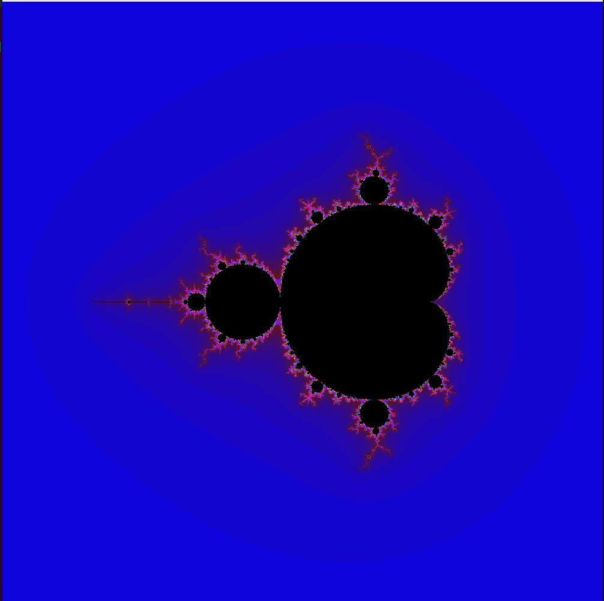

# Mandelbrot

This project is a work on optimization using SSE and AVX intrinsics. The algorithm used for tgis project is Mandelbrot fractal.

Project is written on C++ using SFML library. 

## Optimization results

I have been displaying pixels on the screen in a loop point by point. That's why the process of point-by-point mapping slowed down the optimization of calculations, which consisted in grouping pixels by 4.

Then I've made various measurements in FPS for different optimization flags.

| Optimization |      | -O2  |  -O3   | -Ofast |
| -----------: | ---: | :-:  | -----: | :-:    |
|    no_sse    | 6.15 | 11.1 |  11.2  | 11.6   |
| no_sse + vid | 1.43 | 1.81 |  1.77  | 1.65   |
| sse 128-bit  | 8.62 | 39.6 |  40.3  | 42.6   |
| sse + vid    | 1.69 | 1.85 |  2.01  | 2.14   |

# Control

If you want to run this program at your pc, you will need to know the control of this program.

* Escape - exit from current process

* \= - zoom in

* \- - zoom out

* arrows (← → ↑ ↓) - moving the camera